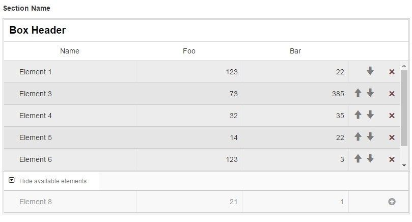

Sorti Boxes
=========

[](https://travis-ci.org/folmert/sorti-boxes)
[](https://coveralls.io/github/folmert/sorti-boxes?branch=master)



Creates boxes with selectable and sortable elements. Requires jQuery 1.7+ and Bootstrap 2+.
- possible to define custom params
- data organized by multiple sections, each containing multiple boxes
- elements beside params can use additional options: special, selected and status
- possible to add optional additional heading
- possible to define custom texts (i.e. for showing / hiding available elements)
- possible to define custom column width for element names (in px or %)
- possible to define amount of visible elements (to define when the container should be scrollable)
- possible to define custom callback function after boxes are rendered and elements are moved

TODO
- support for Bootstrap 3
- test for different versions of jQuery
- CSS to BEM
- CSS: remove magic numbers and quirky code for rwd
- add stylelint
- provide optional custom scope for binded events
- method behind rendering boxes: extract to separate methods


## Installation (only if used with npm)

  ```javascript
  npm install sorti-boxes
  ```

## Usage

```javascript
// pull with <link> and <script> tags (the oldschool way) or require from node_modules (more advised):
require('bootstrap-css-only/css/bootstrap.min.css');
require('kovarik-glyphicons-bootstrap2/glyphicons.css');
require('sorti-boxes/dist/themes/default.css');
require('sorti-boxes');

$('#sortiBoxesContainer').sortiBoxes(options)
```

## Options Example

```javascript
var options = {
        params: [
            {
                name:  'foo', // used for matching element values
                label: 'Foo' // used for displaying in <thead> of all boxes
            },
            {
                name:  'bar',
                label: 'Bar'
            }
        ],
        data:   [
            {
                id:   1,
                name: 'Section name', // will appear as <h5> header

                boxes: [{
                    id:   1,
                    name: 'Box name', // will appear as box header

                    elements: [
                        {
                            id:       1,
                            name:     'Element A', // will appear under Name column
                            special:  true, // will add red dot
                            selected: true, // makes element visible in selected area
                            status:   true, // not used yet, TODO: add new class when element.status == true
                            params: {
                                // keys must match names of main params
                                foo: 7,
                                // accepts HTML too:                                
                                bar: '<span><input type="text" name="box[1][element][1][bar]" value="9"></span>'
                            }
                        },
                        {
                            id:       2,
                            name:     'Element B',
                            special:  false,
                            selected: true,
                            status:   true,
                            params: {
                                foo: 33,
                                bar: '<span><input type="text" name="box[1][element][2][bar]" value="46"></span>'                                
                            }
                        }
                    ]
                }]
            }
        ],
        additionalHeading: '<tr><td>Additional Heading</td></tr>', // will be appended to <thead>, to all boxes
        labels: {
             // labels behind hiding/showing available elements section:
            toggleAvailableOn:  'Show available elements',
            toggleAvailableOff: 'Hide available elements',
             
            selectedBoxInitMsg: 'No elements selected' // will be displayed if no elements are selected
        },
        bootstrapVersion: 2, // will change used Bootstrap classes
        colWidthName:     '25%', // or: '250px'
        amountVisibleInAvailableBox: 10, // defines max-height of the available elements section
        amountVisibleInSelectedBox:  5, // defines max-height of the selected elements section
        // function to fire after element is moved up or down:
        callbackElementMoved: function () {
            console.log('element moved, pass data to form');
        },
        // function to fire after all boxes have been rendered:
        callbackBoxesRendered: function () {
            console.log('boxes rendered, paint them black');
        }
};
```

## Tests

  ```
  npm test
  ```
